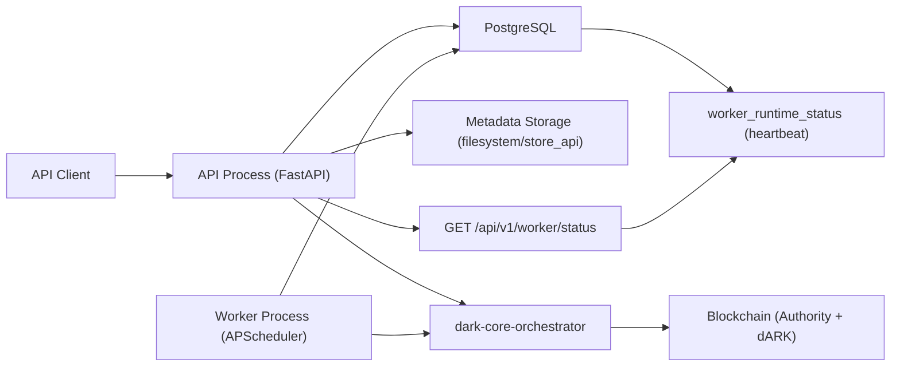
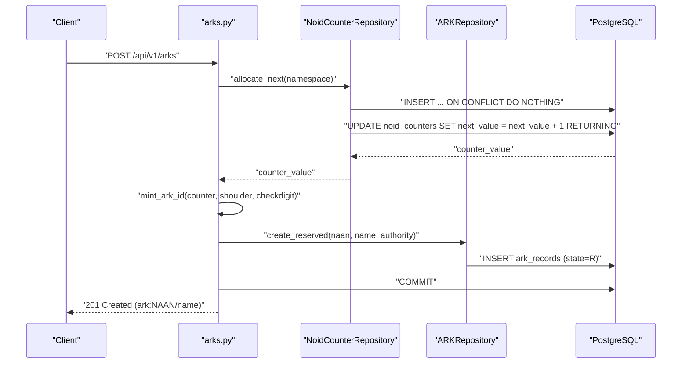
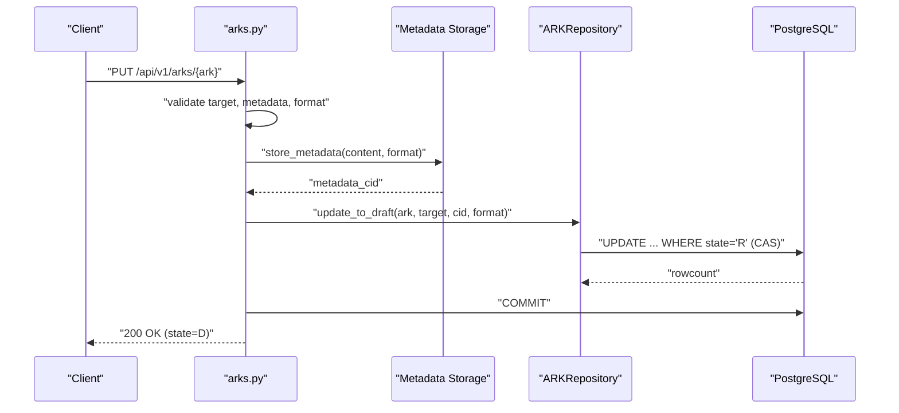
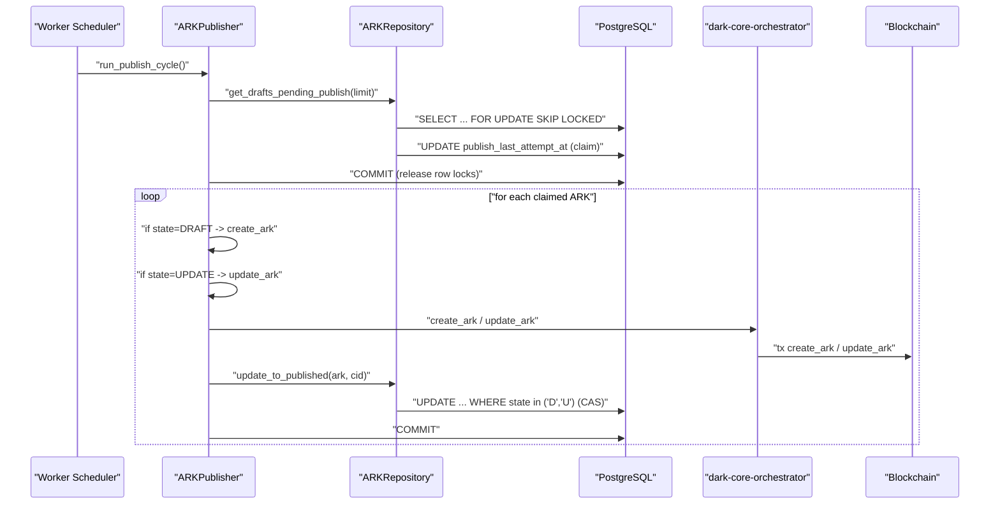
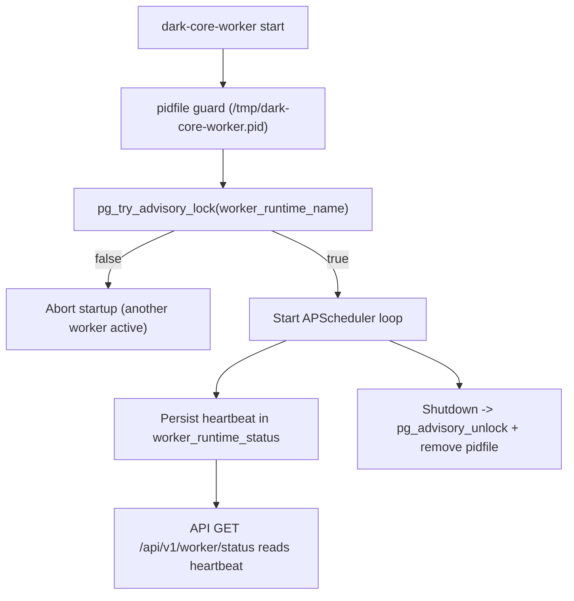
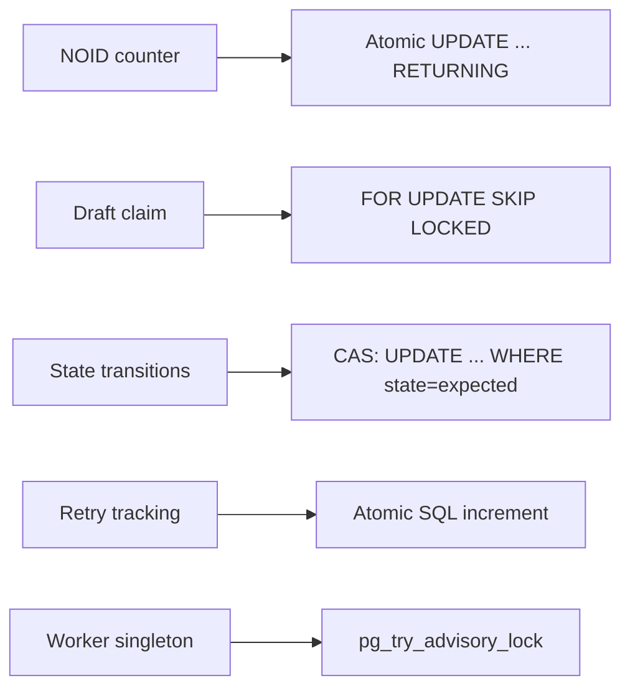
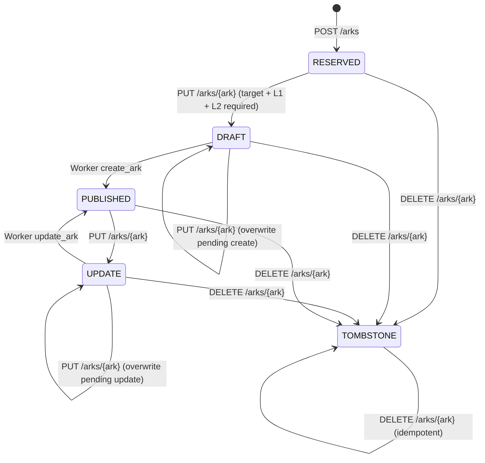
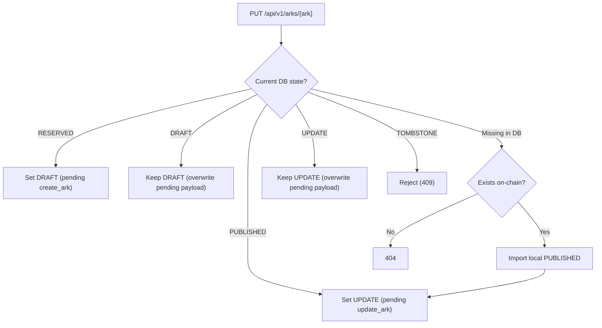
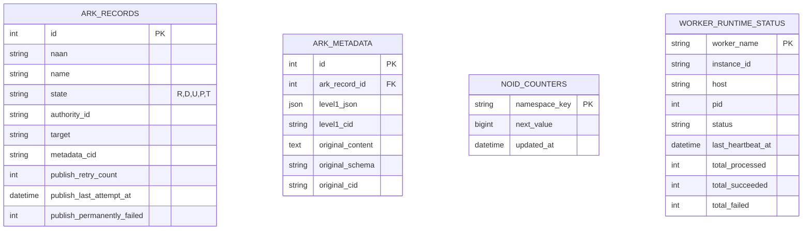

# dARK Core Minter API - Architecture and Flows

This document explains the full minter architecture: runtime components, data flows, ARK lifecycle transitions, and PostgreSQL concurrency controls.

Language note: this document is intentionally maintained in English.

## 1. System Topology

## 2. Main Components

- `app/main.py`: API-only HTTP process.
- `app/main_worker.py`: standalone publisher worker process.
- `app/api/arks.py`: ARK lifecycle endpoints.
- `app/repositories/ark_repository.py`: `ark_records` access with CAS state transitions.
- `app/repositories/noid_counter_repository.py`: deterministic NOID namespace counter.
- `app/workers/publisher.py`: publish loop and retry policy.
- `app/api/worker.py`: worker status endpoint backed by DB heartbeat.
- `app/storage/store_api.py`: metadata backend that delegates persistence to `dark-store-api`.

## 3. ARK Reservation (POST /api/v1/arks)

## 4. Metadata Update (PUT /api/v1/arks/{ark})

Important rule: `target` URL is mandatory for `RESERVED -> DRAFT`.
If `target` is missing or empty, the request is rejected and the ARK stays in `RESERVED`.

## 5. Asynchronous Worker Publish Flow (`DRAFT`/`UPDATE` -> `PUBLISHED`)

## 6. Worker Singleton and Heartbeat

## 7. PostgreSQL Concurrency Strategy

## 8. ARK State Machine

Canonical lifecycle:

Transition rules (command-centric):

## 9. Data Model (Summary)

## 10. Responsibility Map

- API:
  - validates authority.
  - reserves deterministic ARKs.
  - validates and stores L1/L2 metadata in DB.
  - applies `RESERVED -> DRAFT` / `PUBLISHED -> UPDATE` transitions.
  - exposes worker status via heartbeat.
- Worker:
  - safely claims DRAFT/UPDATE records.
  - stores L2 first, then L1 with injected L2 CID.
  - publishes ARKs on-chain using L1 CID.
  - applies `DRAFT -> PUBLISHED` with CAS.
  - reports heartbeat and runtime metrics.
- PostgreSQL:
  - source of truth for lifecycle state.
  - row-level locking for draft claims.
  - CAS-enforced state transitions.
  - advisory lock for distributed singleton worker.
