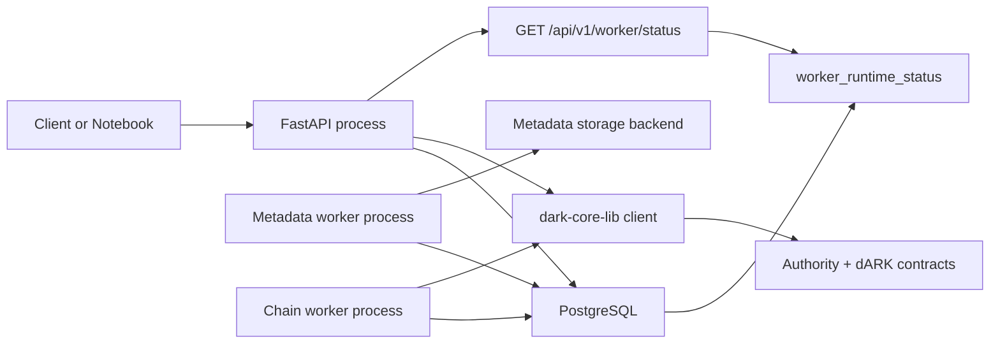
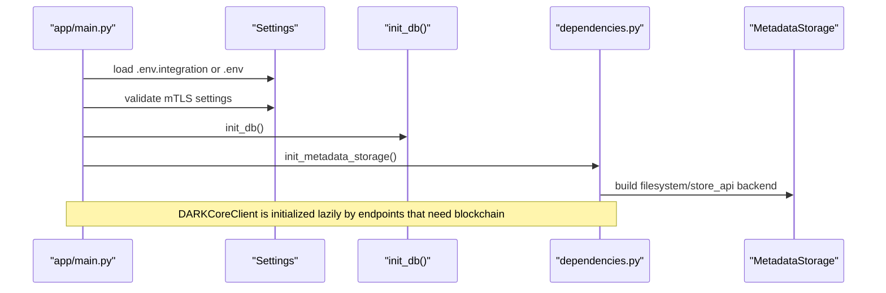
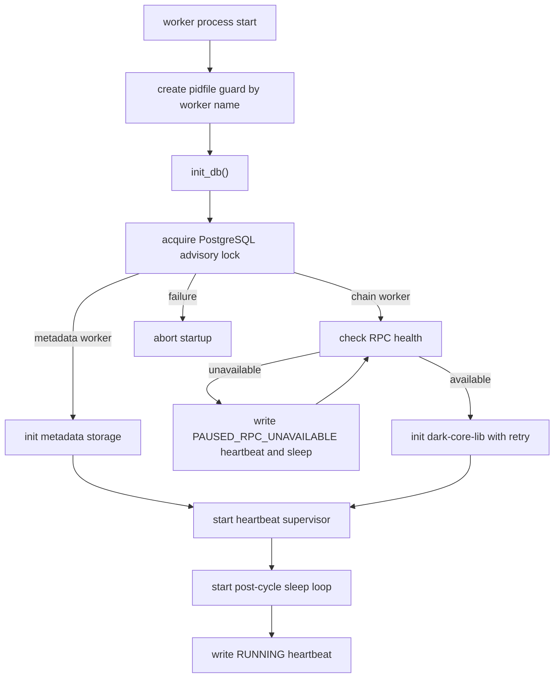
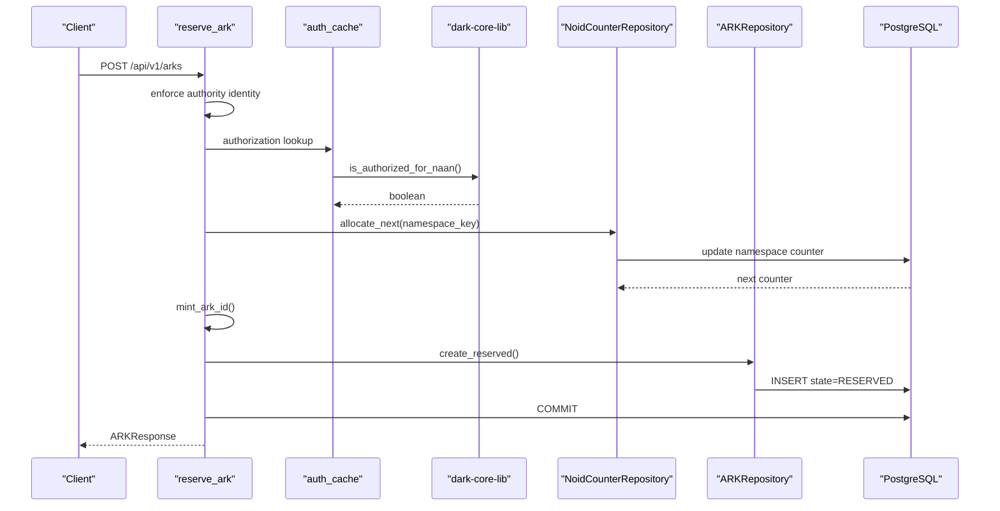
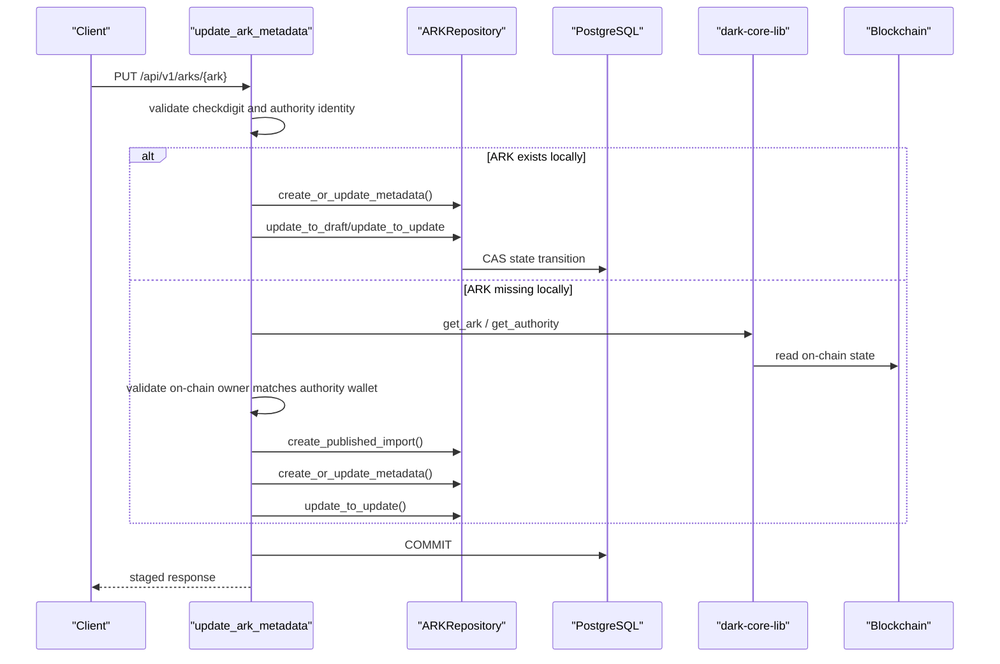
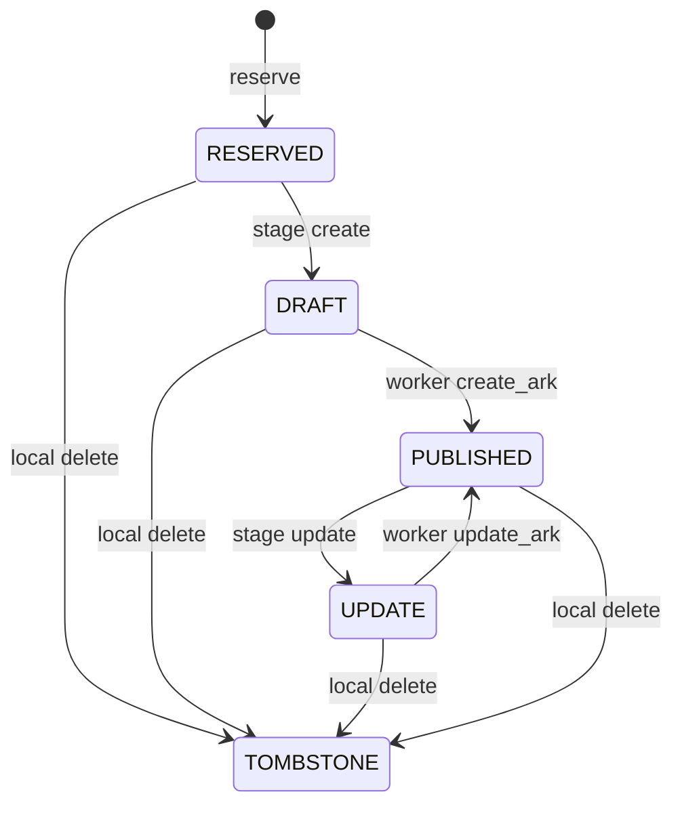
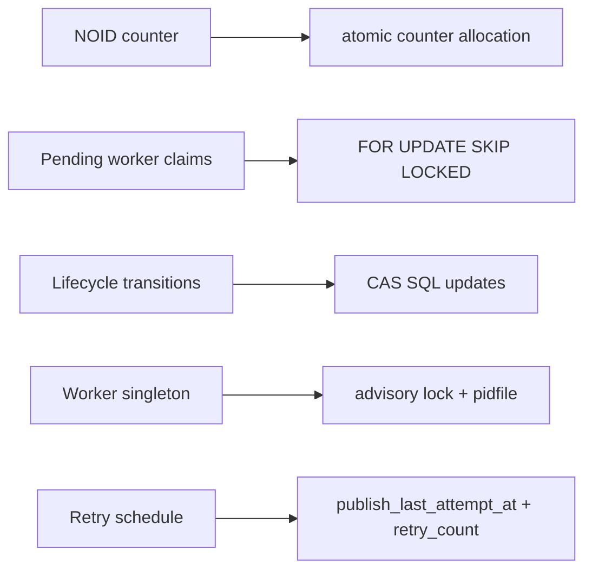
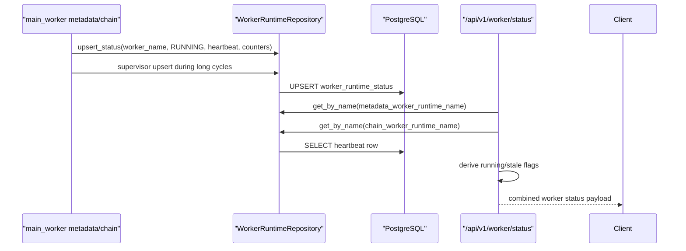
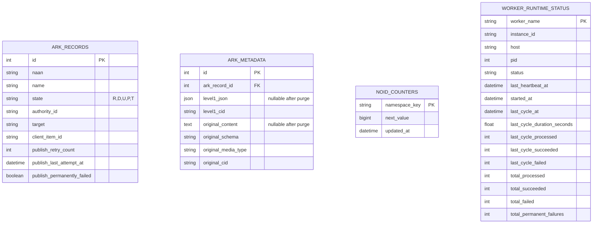
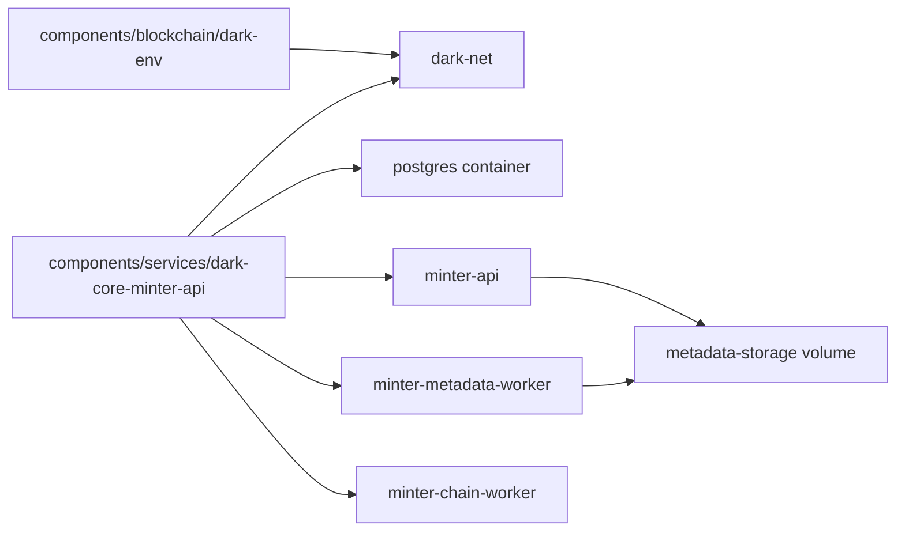

# dARK Core Minter API Architecture

This document complements the main [README](./README.md). The README explains how to use and operate the service; this document focuses on how the minter is implemented internally, why it is structured this way, and which runtime guarantees it relies on.

Language note: this document is intentionally maintained in English.

## 1. Design Goals

The minter is built around a few explicit design choices:

- reservation is local and deterministic
- publication is asynchronous
- PostgreSQL is the local source of truth
- blockchain logic is delegated to `dark-core-lib`
- metadata persistence is pluggable
- each worker execution is singleton-oriented

Those choices let the service accept requests quickly, survive transient blockchain or storage failures, decouple metadata persistence from chain publication, and keep retry state outside process memory.

## 2. Module Map

The service is intentionally split into a few layers.

- HTTP API
  - [`app/main.py`](./app/main.py)
  - [`app/api/router.py`](./app/api/router.py)
  - [`app/api/arks.py`](./app/api/arks.py)
  - [`app/api/authority.py`](./app/api/authority.py)
  - [`app/api/worker.py`](./app/api/worker.py)
- Runtime dependencies
  - [`app/config.py`](./app/config.py)
  - [`app/dependencies.py`](./app/dependencies.py)
  - [`app/middleware/auth.py`](./app/middleware/auth.py)
- Persistence
  - [`app/database/models.py`](./app/database/models.py)
  - [`app/repositories/ark_repository.py`](./app/repositories/ark_repository.py)
  - [`app/repositories/noid_counter_repository.py`](./app/repositories/noid_counter_repository.py)
  - [`app/repositories/worker_runtime_repository.py`](./app/repositories/worker_runtime_repository.py)
- Metadata and validation
  - [`dark_core_lib/metadata/schemas.py`](../../core/dark-core-lib/dark_core_lib/metadata/schemas.py)
  - [`dark_core_lib/metadata/service.py`](../../core/dark-core-lib/dark_core_lib/metadata/service.py)
  - [`dark_core_lib/metadata/storage/filesystem.py`](../../core/dark-core-lib/dark_core_lib/metadata/storage/filesystem.py)
  - [`dark_core_lib/metadata/storage/store_api.py`](../../core/dark-core-lib/dark_core_lib/metadata/storage/store_api.py)
- Worker
  - [`app/main_worker.py`](./app/main_worker.py)
  - [`app/workers/publisher.py`](./app/workers/publisher.py)
- Utilities
  - [`app/utils/noid.py`](./app/utils/noid.py)
  - [`app/utils/auth_cache.py`](./app/utils/auth_cache.py)

## 3. Runtime Topology



The API and workers are separate processes on purpose:

- API stays responsive and transactional
- metadata worker owns storage persistence
- chain worker owns blockchain publication
- retry and failure tracking stay in PostgreSQL
- deployment can scale API while keeping each worker singleton

## 4. Startup and Dependency Wiring

### API Startup

The API startup path in [`app/main.py`](./app/main.py) does three important things:

1. validates runtime configuration
2. verifies database connectivity
3. initializes non-blockchain long-lived singletons

Those singletons are created in [`app/dependencies.py`](./app/dependencies.py):

- metadata storage backend created through `dark_core_lib.metadata.get_metadata_storage(...)`

`DARKCoreClient` is lazy: endpoints that require blockchain initialize it on demand, while DB-only endpoints and worker status can remain available during RPC outages. Alembic migrations are not part of normal startup and must be run explicitly.



### Worker Startup

The worker startup path in [`app/main_worker.py`](./app/main_worker.py) supports two modes: `metadata` and `chain`. Both modes add lifecycle controls on top of normal dependency init:

- pidfile guard
- PostgreSQL advisory lock
- post-cycle sleep loop
- heartbeat persistence, including a supervisor thread for long-running cycles



## 5. Request Path: Reserve

The reserve flow is implemented in [`app/api/arks.py`](./app/api/arks.py) and backed by [`app/repositories/noid_counter_repository.py`](./app/repositories/noid_counter_repository.py).

### Why reservation is local

Reservation is deliberately not a blockchain operation. The goal is:

- fast request latency
- deterministic ARK generation
- no on-chain contention for every reserve
- ability to stage metadata before paying transaction cost

### Flow



### Reservation Guarantees

- the namespace is `NAAN + shoulder`
- generated names use base29 NOID encoding
- a checkdigit can be appended and enforced
- uniqueness is protected by DB constraints plus retry on collision
- the ARK exists locally before any publish attempt is made

## 6. Request Path: Metadata Staging

The update flow is also implemented in [`app/api/arks.py`](./app/api/arks.py), but the actual state transitions live in [`app/repositories/ark_repository.py`](./app/repositories/ark_repository.py).

### Why staging exists

Staging separates client write success from blockchain publication success.

That gives us:

- predictable HTTP latency
- explicit `DRAFT` and `UPDATE` states
- retries outside the request thread
- room for metadata storage failures and blockchain failures without losing intent

### Flow



### Important Rules

- reserve endpoints only allocate ARKs; `target` is supplied later during `PUT /arks/{ark}`
- `RESERVED -> DRAFT` requires a non-empty `target`
- `DRAFT` rejects further `PUT` requests until the worker publishes or tombstones it
- `PUBLISHED -> UPDATE` stages a blockchain update
- `UPDATE` rejects further `PUT` requests until the worker publishes or tombstones it
- `TOMBSTONE` is terminal for write flows

## 7. Worker-Owned Slow Paths

The slow-path logic lives in [`app/workers/publisher.py`](./app/workers/publisher.py). Workers do not keep long-lived in-memory queues. Each worker queries PostgreSQL every cycle, claims work there, and records retry state in the same rows.

### Why storage and chain publication are separate

Storage writes and blockchain transactions have different failure modes, latency profiles, and operational dependencies. Splitting them keeps each stage easier to reason about:

- metadata CIDs are produced before any chain call
- blockchain retries can reuse previously stored CIDs
- local metadata payloads can be purged once CIDs are complete
- blockchain calls happen outside the request path
- publication metrics can be derived from DB and worker heartbeat
- minter and resolver can share the same Level-1 schema and storage contract without duplicating code

### Metadata Persistence Cycle

```mermaid
sequenceDiagram
    participant Loop as "worker loop"
    participant Worker as "MetadataPersistenceWorker"
    participant Repo as "ARKRepository"
    participant DB as "PostgreSQL"
    participant Store as "Metadata backend"

    Loop->>Worker: run_publish_cycle()
    Worker->>Repo: get_metadata_pending_persist()
    Repo->>DB: SELECT DRAFT/UPDATE with incomplete CIDs
    Repo->>DB: mark publish_last_attempt_at
    Worker->>DB: commit claim

    loop each claimed ARK
        Worker->>Repo: load record + metadata
        Worker->>Store: store Level-2
        Store-->>Worker: original_cid
        Worker->>Store: store Level-1 with embedded original_cid
        Store-->>Worker: level1_cid
        Worker->>Repo: update_metadata_cids(purge_local=true, reset_publish_tracking=true)
        Worker->>DB: commit
    end
```

### Chain Publication Cycle

```mermaid
sequenceDiagram
    participant Loop as "worker loop"
    participant Worker as "ChainPublisherWorker"
    participant Repo as "ARKRepository"
    participant DB as "PostgreSQL"
    participant Core as "dark-core-lib"
    participant Chain as "Blockchain"

    Loop->>Worker: run_publish_cycle()
    Worker->>Repo: get_chain_pending_publish()
    Repo->>DB: SELECT ... FOR UPDATE SKIP LOCKED
    Repo->>DB: set publish_last_attempt_at
    Worker->>DB: commit claim

    Worker->>Worker: group claimed ARKs by authority_id

    loop each authority group
        Worker->>Core: publish_ark_operations(operations, pipeline_size)
        Core->>Chain: send signed txs with sequential pending nonces
        Core->>Chain: wait receipts and return one result per ARK
        alt result confirmed
            Worker->>Repo: update_to_published()
        else reverted, ambiguous, send_failed, or not_sent
            Worker->>Core: get_ark(naan, name)
            alt on-chain target + CID match expected state
                Worker->>Repo: update_to_published()
            else missing/divergent on-chain state
                Worker->>Repo: mark retryable or permanent failure
            end
        end
        Worker->>DB: commit
    end
```

The chain worker's normal success path is intentionally write-only after the local claim. It calls `dark-core-lib` through `publish_ark_operations(...)`, so the worker path does not run routine `exists()` before create/update writes, and it does not run routine `get()` after successful receipts. The core library sends individual transactions with sequential pending nonces per authority window; `CHAIN_WORKER_PAGE_SIZE` controls both the claim size and the core-lib pipeline window, and defaults to `20`.

Reconcile is reserved for error handling. It is a verification step, not a mutation step:

- if on-chain `url` and `cid` already match the expected `target` and `level1_cid`, the worker finalizes local state as `PUBLISHED`;
- if a `DRAFT` create finds an existing but different ARK, the worker treats it as a permanent conflict and does not automatically run `update_ark`;
- if an `UPDATE` finds a different or missing on-chain ARK, the original error class decides retry vs permanent failure;
- if the reconcile read itself fails, the worker falls back to the original error classification.

### Storage Ordering

The ordering is intentional:

1. store Level-2 raw payload
2. inject `original_metadata.cid` into Level-1 JSON
3. store finalized Level-1 JSON
4. persist both CIDs in PostgreSQL
5. purge local `level1_json` and `original_content`
6. publish the Level-1 CID on-chain from the chain worker

This makes Level-1 the canonical chain-facing entry point while still preserving the original payload.

The concrete implementation of these steps is now shared through `dark_core_lib.metadata.MetadataService`.

## 8. State Transition Model

The lifecycle enum is defined in [`app/models/states.py`](./app/models/states.py), but the business meaning comes from how API and worker cooperate.



### Compare-and-Set Transitions

The repository uses compare-and-set style updates for critical transitions:

- expected current state is part of the SQL predicate
- if `rowcount == 0`, caller reloads and treats it as conflict

This is one of the main protections against races between API and worker or between multiple update attempts.

## 9. Concurrency Model

The minter relies on PostgreSQL semantics for most of its concurrency guarantees.

### Summary



### Counter Allocation

The counter repository uses:

- a namespace row in `noid_counters`
- atomic increment on PostgreSQL
- fallback logic for non-PostgreSQL dialects

Operationally, the minter is designed around PostgreSQL deployment, and that is where the strongest guarantees exist.

### Worker Claims

`get_metadata_pending_persist()` and `get_chain_pending_publish()` do not keep long row locks for the whole external operation. Instead they:

1. selects pending records with `FOR UPDATE SKIP LOCKED`
2. marks them as attempted
3. commits the claim
4. processes each ARK independently

That design avoids long locks during slow external operations such as:

- storage writes
- blockchain RPC calls
- gas estimation
- transaction propagation

### Retry Policy

Retry state is persisted in the DB, not memory:

- `publish_retry_count`
- `publish_last_attempt_at`
- `publish_permanently_failed`
- `publish_last_error`

That means retries survive:

- process restart
- container recreation
- worker crashes

The same `publish_*` fields track whichever stage is currently active. Before both metadata CIDs exist they refer to metadata persistence; after both CIDs exist they refer to blockchain publication. The metadata worker resets these fields once CIDs are complete, so the chain worker starts with a clean retry budget.

## 10. Worker Runtime Status

Worker liveness is represented in the database through `worker_runtime_status`, not by inspecting process internals over IPC.



This makes worker status available even when:

- API and worker are different containers
- worker logs are not directly accessible
- only the shared database is visible

`GET /api/v1/worker/status` returns a compact operational summary by default:

- `overall`: `ok`, `degraded`, or `down`
- `message`: one-line human-readable status
- `workers.metadata` and `workers.chain`: compact worker state, liveness, last-cycle summary, and queue summary
- `errors`: aggregate retrying/permanent error counts
- `arks`: aggregate ARK counts by lifecycle state

Queue metrics are read-only aggregate queries over `ark_records` and `ark_metadata`.

In compact mode, `last_cycle.processed` is the number of ARKs attempted in the latest cycle. It is not a lifetime counter and it is not the queue size. For metadata it means "attempted metadata persistence"; for chain it means "attempted on-chain publication". `last_cycle.succeeded` means persisted for metadata and published or reconciled-as-published for chain.

`GET /api/v1/worker/status?detail=full` returns detailed heartbeat, queue, cadence, config, and host/process fields. In full mode, each worker status includes `cadence` metrics:

- `last_cycle_duration_seconds` and last-cycle attempted/succeeded/failed counts
- `page_size`, `sleep_seconds`, `next_action`, and `sleep_seconds_next`
- `last_cycle_full_page`, true when the previous cycle processed at least one full page
- `cycle_utilization_ratio`, calculated as cycle duration divided by worker sleep
- `ready_pages` and `estimated_seconds_to_drain_ready` for the ready queue
- `pressure`, a compact state for operational dashboards

Full status also includes `config.chain.worker_page_size`, which is the active max in-flight transaction window per authority because chain page size and pipeline size are the same.

## 11. Data Model



### Table Roles

- `ark_records`
  - lifecycle state and identity of each ARK
- `ark_metadata`
  - staged metadata payloads, published CIDs, and schema/media-type fields
  - `level1_json` and `original_content` are nullable because they are purged after successful metadata persistence
- `noid_counters`
  - deterministic namespace counters
- `worker_runtime_status`
  - distributed worker heartbeat and counters

## 12. Security Model

The security model is intentionally split between local-dev ergonomics and production deployment assumptions.

### Local Developer Mode

When `MTLS_ENABLED=false`:

- mutating endpoints require `X-Authority-Id` or `X-Authority-UUID`
- body `authority_id` must match the resolved identity
- NAAN authorization is still checked against the blockchain layer via `dark-core-lib`

This makes notebooks and local integration easy, but it is not a complete production identity model.

### Production-Oriented Mode

When `MTLS_ENABLED=true`:

- the service expects a valid client certificate flow
- authority identity is resolved from trusted request information

The architecture assumes a trusted TLS termination path or equivalent deployment control. That boundary matters because the application can consume certificate-related request headers.

## 13. Deployment Notes

### Monorepo Docker Deployment



Important deployment assumptions:

- blockchain is already running on `dark-net`
- API and both workers share PostgreSQL
- API and metadata worker share metadata storage when filesystem backend is used
- chain worker does not need local metadata payloads; it only needs target, authority, ARK identity, and CIDs
- `.env.integration` is the preferred deployed config file

## 14. Tradeoffs and Current Limits

Some tradeoffs are intentional and worth documenting explicitly.

- tombstone is currently local, not an on-chain revoke
- publication is eventually consistent, not immediate
- PostgreSQL is the real operational target; non-PostgreSQL fallback paths are weaker
- request success for staging does not mean on-chain success yet
- worker heartbeat is best-effort status reporting, not a hard availability proof

## 15. Reading Order

If you are onboarding to the codebase, this order works well:

1. [README.md](./README.md)
2. [`app/main.py`](./app/main.py)
3. [`app/api/arks.py`](./app/api/arks.py)
4. [`app/repositories/ark_repository.py`](./app/repositories/ark_repository.py)
5. [`app/workers/publisher.py`](./app/workers/publisher.py)
6. [`app/main_worker.py`](./app/main_worker.py)
7. [`app/middleware/auth.py`](./app/middleware/auth.py)
